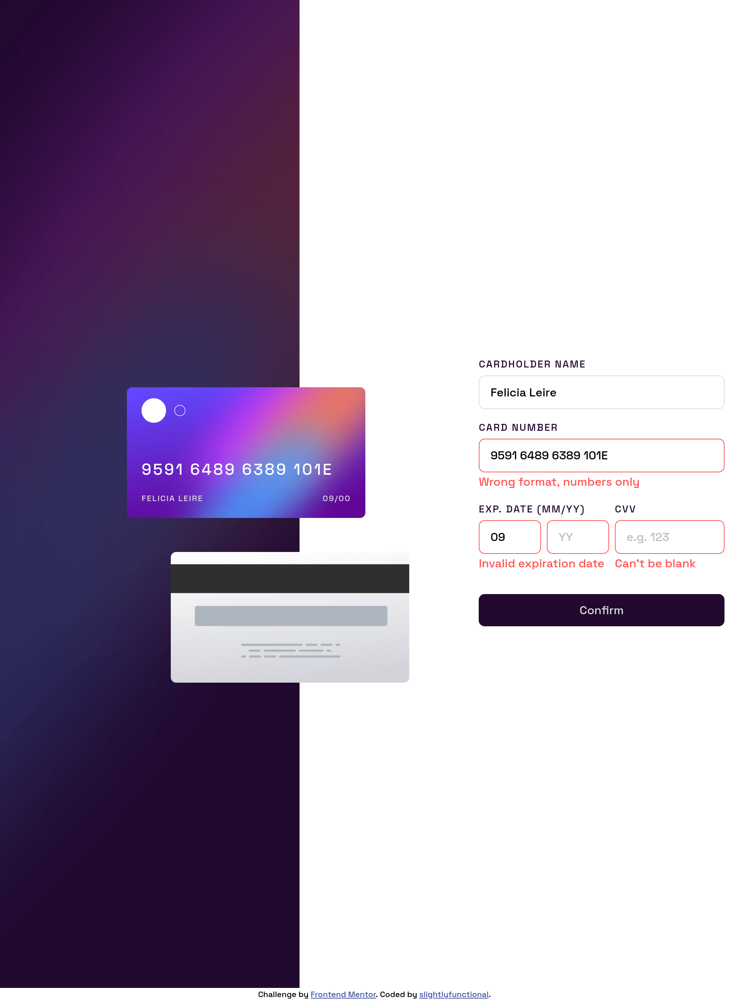

# Frontend Mentor - Interactive card details form solution

This is a solution to the [Interactive card details form challenge on Frontend Mentor](https://www.frontendmentor.io/challenges/interactive-card-details-form-XpS8cKZDWw). Frontend Mentor challenges help you improve your coding skills by building realistic projects. 

## Table of contents

- [Overview](#overview)
  - [The challenge](#the-challenge)
  - [Screenshot](#screenshot)
  - [Links](#links)
- [My process](#my-process)
  - [Built with](#built-with)
  - [What I learned](#what-i-learned)
  - [Continued Development](#continued-development)
- [Author](#author)

## Overview

### The challenge

Users should be able to:

- Fill in the form and see the card details update in real-time
- Receive error messages when the form is submitted if:
  - Any input field is empty
  - The card number, expiry date, or CVC fields are in the wrong format
- View the optimal layout depending on their device's screen size
- See hover, active, and focus states for interactive elements on the page

### Screenshot

### Links

- Live Site URL: [Interactive Card Details Form](https://slightlyfunctional.gitlab.io/interactive-card-details-form/)

## My process

### Built with

- Semantic HTML5 markup
- CSS custom properties
- Flexbox
- Mobile-first workflow
- [Svelte](https://svelte.dev/) - JS Framework
- [Vite](https://vitejs.dev/) - Vite Bundler

### What I learned

This is the first time using Svelte on a project. It felt a lot like Vue except the reactivity is implicit versus Vue requiring you to manually declare variables as reactive. The documentation was pretty straight forward and easy to figure out. I am genuinely impressed by the build size, it seems much faster and smaller than React and Vue.

### Continued development

This project is heavily focusing on accessibility as it seems to be a weak area of mine needing improvement. I made sure aria-labels were added to form controls and included a hidden heading while referencing the [web accessibility evaluation tool](https://wave.webaim.org/) to ensure no accessibility errors.

## Author

- Website - [slightlyfunctional.com](https://slightlyfunctional.com)
- Frontend Mentor - [@slightlyfunctional](https://www.frontendmentor.io/profile/slightlyfunctional)
